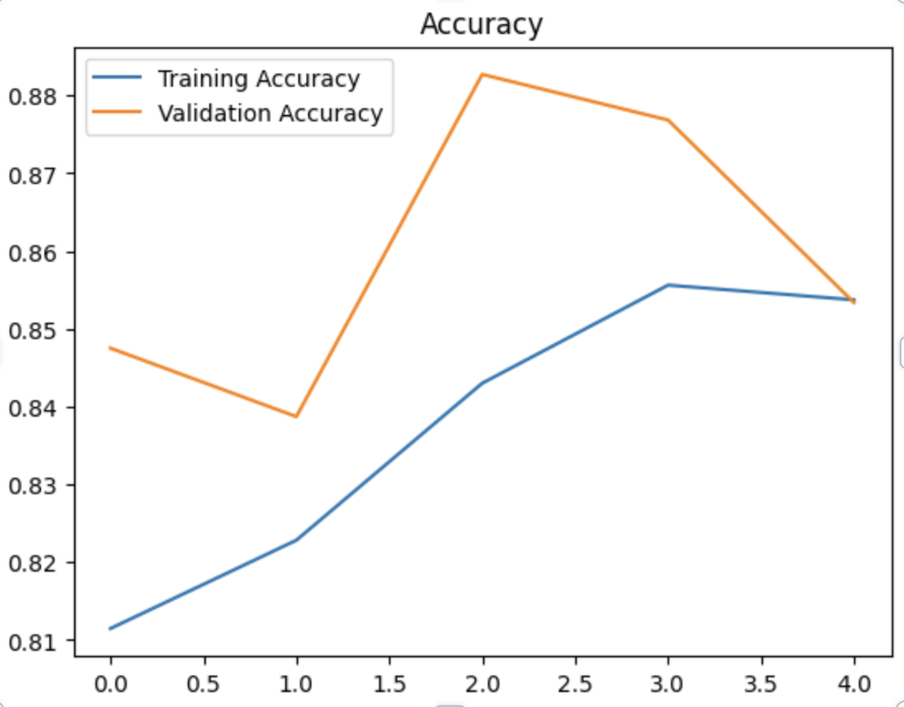
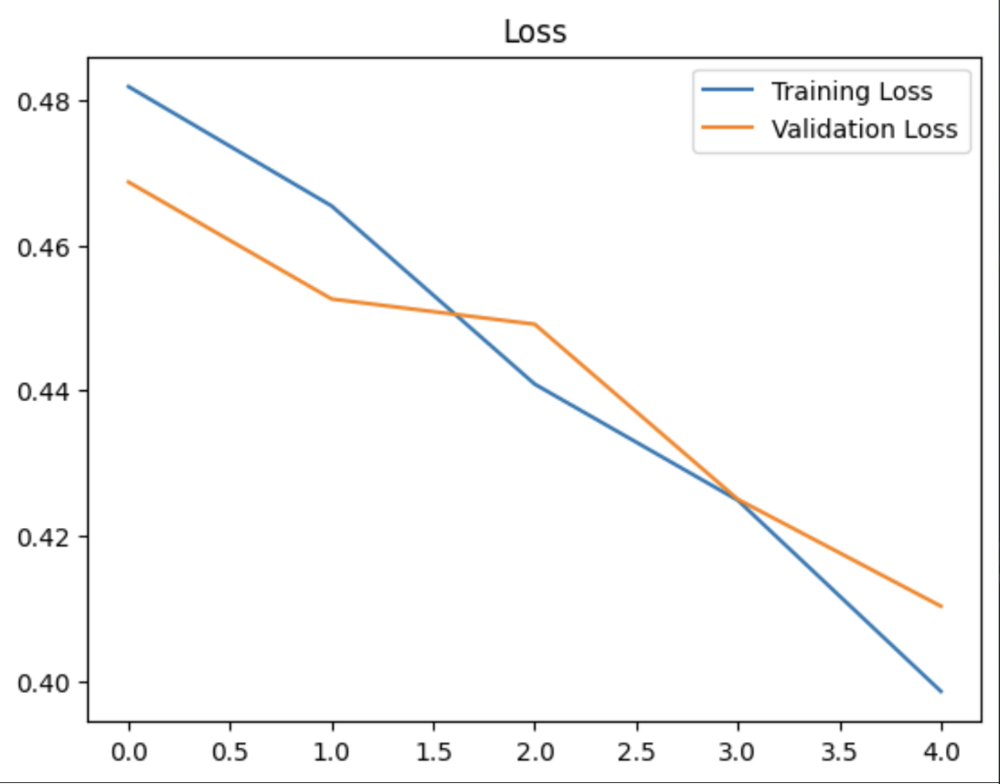

<h1 align=center>🧠 Glioblastoma Detection from fMRI Images 🩺</h1>

For a DS3 project, we worked on displaying and analyzing the results of an fMRI-based tumor detection model. 
The model itself is designed as a tool to help physicians assess the likelihood of glioblastomas  

## Background Information

 
Glioblastomas (GBs) are a type of malignant, glial, primary brain tumor. Brain tumors can be either cancerous (malignant), which spread to other parts of the body, or noncancerous (benign), which grow slowly and do not spread. 
Regardless of type, tumor growth in the brain can increase intracranial pressure, which can become fatal and life-threatening quickly. Brain tumors are classified based on their origin (primary or metastatic), cell type (glial or non-glial), and cancerous status (benign or malignant). 
Among adult-type diffuse gliomas, there are three subtypes: astrocytoma, oligodendroglioma, and glioblastoma. The focus for this model is on glioblastomas, as they are the most aggressive and fast-growing form, requiring urgent and specialized treatment 

## Limitations of the Model

The model presented an accuracy score of <b>84%</b> and an F1 score of <b>82%</b> 
These numbers can be further improved on to result in higher accuracy percentages. 

## Future Directions
- We can further improve our model by incorporating more datasets. 
- We can also broaden the tool's ability to detect from a wider range of tumors, such as meningomas, pituitary, etc. 
- Implement other types of neuroimaging methods such as PET, CT, etc.  
- Attain more images of the brain that are saggital, and coronal.

## Datasets
We used a couple of datasets from: 
https://www.kaggle.com/navoneel/brain-mri-images-for-brain-tumor-detection 
https://www.kaggle.com/datasets/sartajbhuvaji/brain-tumor-classification-mri 

## Data Preprocessing

For every image, the following preprocessing steps were applied:

1. Crop the part of the image that contains only the brain (which is the most important part of the image).
2. Resize the image to have a shape of (240, 240, 3)=(image_width, image_height, number of channels): because images in the dataset come in different sizes. So, all images should have the same shape to feed it as an input to the neural network.
3. Apply normalization: to scale pixel values to the range 0-1.

## Data Split:

The data was split in the following way:
1. 70% of the data for training.
2. 15% of the data for validation.
3. 15% of the data for testing.

# Neural Network Architecture Implemented

This is the architecture:

**Understanding the architecture:** 
Each input x (image) has a shape of (240, 240, 3) and is fed into the neural network. And, it goes through the following layers: 

1. A Zero Padding layer with a pool size of (2, 2).
2. A convolutional layer with 32 filters, with a filter size of (7, 7) and a stride equal to 1.
3. A batch normalization layer to normalize pixel values to speed up computation.
4. A ReLU activation layer.
5. A Max Pooling layer with f=4 and s=4.
6. A Max Pooling layer with f=4 and s=4, same as before.
7. A flatten layer in order to flatten the 3-dimensional matrix into a one-dimensional vector.
8. A Dense (output unit) fully connected layer with one neuron with a sigmoid activation (since this is a binary classification task).

**Why this architecture?** 

Firstly, I applied transfer learning using a ResNet50 and vgg-16, but these models were too complex to the data size and were overfitting. Of course, you may get good results applying transfer learning with these models using data augmentation. But, I'm using training on a computer with 6th generation Intel i7 CPU and 8 GB memory. So, I had to take into consideration computational complexity and memory limitations. 

So why not try a simpler architecture and train it from scratch. And it worked :)

# Results

Now, the best model (the one with the best validation accuracy) detects brain tumor with: 

**84.71%** accuracy on the **test set**. 
**0.81** f1 score on the **test set**. 

## Acknowledgments
We acknowledge the wonderful brains of ds3 for providing us the opportunity to collaborate and work on a machine learning project.  
Additionally,  
This project uses parts of [Brain Tumor Detection](https://github.com/MohamedAliHabib/Brain-Tumor-Detection), which is licensed under the Apache License 2.0.

Copyright 2019 Mohamed Ali Habib

Licensed under the Apache License, Version 2.0 (the "License");
you may not use this file except in compliance with the License.
You may obtain a copy of the License at:

[http://www.apache.org/licenses/LICENSE-2.0](http://www.apache.org/licenses/LICENSE-2.0)

Unless required by applicable law or agreed to in writing, software
distributed under the License is distributed on an "AS IS" BASIS,
WITHOUT WARRANTIES OR CONDITIONS OF ANY KIND, either express or implied.

